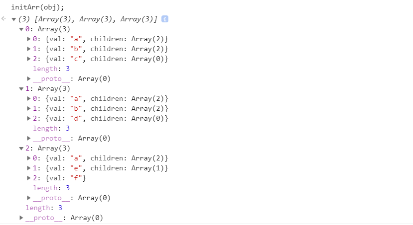

用递归的方式将树结构从根到叶子节点解析成数组
<!-- more -->

从后台获取树结构的 json 数据，渲染成树图结构
由于项目需求，需要将所有可行链路展示出来，于是采用递归方式将树结构解析为数组
算法不算复杂，但用很多细节需要注意，很有价值，故记录下来以备以后查看

``` bash
数据结构如下：                
     a                       
    / \     
   b   e     
  / \   \     
 c   d   f     
```

``` bash
const obj = {
  val: 'a',
  children: [
    { val: 'b', children: [
        { val: 'c', children: [] },
        { val: 'd', children: [] },
      ],
    },
    { val: 'e', children: [
        { val: 'f', }
      ],
    },
  ],
};
```

废话不多说，直接上代码
``` bash
// 法一
const initArr = (obj) => {
  const newArr = [];                                        // 定义空数组，用于每次遍历结束后存储结果
  (function travel(item, arr){                              // 回调函数，立即执行 item为每次执行处理的对象，arr为叠加数组
    if (item.children && item.children.length) {            // 判断是否存在子元素，存在则遍历子元素递归调用
      for (let i = 0; i < item.children.length; i += 1) {
        travel(item.children[i], arr.concat(item));         // 递归调用，并对数组 arr 进行叠加，注：此处不能用push，因此处是作为参数用来传递的，push 返回的是数组长度
      }
    } else {                                                // 若不存在子元素，则一条链路遍历结束，将叠加数组添加到 newArr 中
      newArr.push(arr.concat(item));                        // 注意此处要记得将本次递归的 item 添加到arr中
    }
  }(obj, []));                                              // 初始递归调用，此时的 item 为传入的树结构， 叠加数组arr为空
  return newArr;
}
```

``` bash
// 法二
const initArr = (obj) => {
  const newArr = [];
  (function travel(item, arr){
    const itemArr = [...arr];                      // ES6 深拷贝数组，此处是让每次travel都有一个独立的itemArr, 防止公用全局arr叠加时造成污染
    itemArr.push(item);                            // 由于 itemArr 为每次递归独立的叠加数组，故直接 push 改变数组本身即可
    if (item.children && item.children.length) {
      for (let i in item.children) {
        travel(data.children[i], itemArr);
      }
    } else {
      newArr.push(itemArr);
    }
  })(obj, [])
  return newArr;
}
```

`
结果如下图
`


